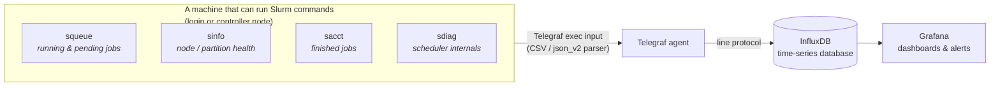

# telegraf-slurm-cfg

**Monitor a Slurm cluster without writing any scripts — just drop in these Telegraf config files.**

Every collector here is a single `.conf` file you copy into Telegraf's config
directory. No Python, no Bash wrappers, no cron jobs, nothing to maintain. The
Slurm commands already print machine-readable output; Telegraf's built-in
parsers turn that straight into metrics. That's the whole trick.

---

## Wait — what are Slurm, Telegraf, and InfluxDB?

If you already know, skip to [Quick start](#quick-start). If not, here's the
30-second version:

- **Slurm** is the software that runs big shared computers ("clusters"). When
  hundreds of people want to run jobs on thousands of CPUs/GPUs, Slurm decides
  whose job runs where and when. You talk to it with commands like `squeue`
  (what's in the queue?) and `sinfo` (which machines are free?).
- **Telegraf** is a small "agent" program that runs on a machine, collects
  numbers (CPU usage, disk space, … or in our case, Slurm stats), and ships
  them somewhere. It has dozens of built-in *parsers* — it already knows how to
  read CSV and JSON, which is exactly what we exploit here.
- **InfluxDB** is a database built for time-stamped numbers ("time series").
  Telegraf writes the Slurm numbers into it every few seconds.
- **Grafana** (optional) reads InfluxDB and draws the dashboards and graphs.

So the data flows: **Slurm command → Telegraf → InfluxDB → Grafana.**



---

## Why "no scripts"?

The usual way people feed Slurm into a database is to write a wrapper script
(Bash or Python) that runs `squeue`, reshapes the output, and prints something
the database understands. That script is one more thing to deploy, version, and
break.

You don't need it. Slurm's own tools can already print clean, delimited output,
and Telegraf already has parsers for that format:

| Tool | How we get clean output | Telegraf parser |
|------|-------------------------|-----------------|
| `squeue` | `--format=%i\|%P\|...` → `\|`-delimited columns | `csv` |
| `sinfo`  | `--format=%R\|%T\|...` → `\|`-delimited columns | `csv` |
| `sacct`  | `--parsable2 --format=...` → `\|`-delimited columns | `csv` |
| `sdiag`  | `--json` → JSON object of scalar counters | `json_v2` |

So each collector is just an `[[inputs.exec]]` block that runs the command and
tells Telegraf which parser to use. Everything lives in the `.conf`.

---

## Quick start

1. **Install Telegraf** on a machine that can run `squeue`/`sinfo`/etc.
   (usually a login or controller node). See InfluxData's Telegraf docs.

2. **Tell Telegraf where to send data** — add an output once, in
   `/etc/telegraf/telegraf.conf`. For InfluxDB 2.x / 3.x:

   ```toml
   [[outputs.influxdb_v2]]
     urls = ["http://YOUR_INFLUX_HOST:8086"]
     token = "YOUR_WRITE_TOKEN"
     organization = "YOUR_ORG"
     bucket = "slurm"
   ```

3. **Drop in the collectors you want** — copy any of the `.conf` files from
   [`telegraf.d/`](telegraf.d/) into Telegraf's include directory
   (`/etc/telegraf/telegraf.d/`):

   ```bash
   sudo cp telegraf.d/slurm-squeue.conf /etc/telegraf/telegraf.d/
   sudo cp telegraf.d/slurm-sinfo.conf  /etc/telegraf/telegraf.d/
   sudo systemctl restart telegraf
   ```

4. **Check it works** before committing to it — `--test` runs the input once
   and prints what *would* be written, without touching the database:

   ```bash
   telegraf --test --config telegraf.d/slurm-squeue.conf
   ```

That's it. Metrics start flowing into InfluxDB; point Grafana at it and graph.

---

## The collectors

Each measurement uses **low-cardinality tags** (partition, state, user, …) and
keeps unbounded values (job IDs, names) as **fields**, which is what InfluxDB
wants. Telegraf automatically adds a `host` tag. Uncomment the
`[inputs.exec.tags]` block in any file to add a static `cluster` tag.

### 1. `squeue` → `slurm_jobs` (the queue)

One point per job currently running or waiting.
[`telegraf.d/slurm-squeue.conf`](telegraf.d/slurm-squeue.conf)

**Example output** (InfluxDB line protocol):

```
slurm_jobs,host=login01,partition=gpu,state=RUNNING,user=alice,account=physics,qos=normal cpus=32i,nodes=1i,priority=4294901760i,job_id="128411",time_limit="1-00:00:00",time_used="2:14:08",nodelist="gpu-node-007",reason="None"
slurm_jobs,host=login01,partition=cpu,state=PENDING,user=bob,account=chem,qos=long    cpus=256i,nodes=8i,priority=100i,job_id="128412",time_limit="UNLIMITED",time_used="0:00",nodelist="",reason="Resources"
```

| Tags | Fields |
|------|--------|
| `partition`, `state`, `user`, `account`, `qos` | `job_id`, `cpus`, `nodes`, `priority`, `time_limit`, `time_used`, `nodelist`, `reason` |

Great for: "how many jobs are running vs pending per partition", "who is using
the most CPUs right now", "why are jobs stuck pending" (group by `reason`).

### 2. `sinfo` → `slurm_nodes` (node health)

One point per partition + node-state. `sinfo` already aggregates the counts.
[`telegraf.d/slurm-sinfo.conf`](telegraf.d/slurm-sinfo.conf)

**Example output:**

```
slurm_nodes,host=login01,partition=gpu,state=idle      nodes=4i,cpus_state="0/128/0/128",memory_mb=515000i
slurm_nodes,host=login01,partition=gpu,state=allocated nodes=8i,cpus_state="256/0/0/256",memory_mb=515000i
slurm_nodes,host=login01,partition=cpu,state=mixed     nodes=2i,cpus_state="40/24/0/64",memory_mb=192000i
slurm_nodes,host=login01,partition=cpu,state=drain     nodes=1i,cpus_state="0/0/32/32",memory_mb=192000i
```

| Tags | Fields |
|------|--------|
| `partition`, `state` | `nodes`, `cpus_state` (Slurm's `allocated/idle/other/total` string), `memory_mb` |

Great for: "how many nodes are down/draining", "free vs busy capacity per
partition". (`cpus_state` is Slurm's compact `A/I/O/T` string; split it in
Grafana if you want the four numbers separately.)

### 3. `sacct` → `slurm_sacct` (finished jobs)

One point per job that has *ended*, from the accounting database.
[`telegraf.d/slurm-sacct.conf`](telegraf.d/slurm-sacct.conf)

> **Needs Slurm accounting (`slurmdbd`).** If `sacct` says *"Slurm accounting
> storage is disabled"*, your cluster doesn't store this — enable slurmdbd or
> skip this collector.

**Example output:**

```
slurm_sacct,host=login01,partition=gpu,state=COMPLETED,user=alice,account=physics,qos=normal job_id="128837",cpus=32i,nodes=1i,elapsed_sec=3725i,cpu_sec=119200i,req_mem="64Gn",start="2026-06-15T10:00:00",end="2026-06-15T11:02:05",submit="2026-06-15T09:59:50",exit_code="0:0"
slurm_sacct,host=login01,partition=cpu,state=FAILED,user=bob,account=chem,qos=long          job_id="128840",cpus=8i,nodes=1i,elapsed_sec=12i,cpu_sec=96i,req_mem="4Gc",start="2026-06-15T10:30:00",end="2026-06-15T10:30:12",submit="2026-06-15T10:29:00",exit_code="1:0"
```

| Tags | Fields |
|------|--------|
| `partition`, `state`, `user`, `account`, `qos` | `job_id`, `cpus`, `nodes`, `elapsed_sec`, `cpu_sec`, `req_mem`, `start`, `end`, `submit`, `exit_code` |

Great for: job throughput, failure rates, CPU-hours per account, turnaround
time. It queries a small rolling window each run so jobs aren't re-sent forever
— tune the window and `--state` list in the file.

### 4. `sdiag` → `slurm_sched` (scheduler internals)

One point with ~40 fields describing how the scheduler itself is performing.
[`telegraf.d/slurm-sdiag.conf`](telegraf.d/slurm-sdiag.conf)

> **Needs `sdiag --json`** (Slurm 23.02+). Older Slurm only prints plain text.

**Example output** (trimmed — there are ~40 fields):

```
slurm_sched,host=login01 server_thread_count=3,agent_queue_size=0,jobs_submitted=1543,jobs_started=1402,jobs_completed=1388,jobs_pending=512,jobs_running=128,schedule_cycle_last=842,schedule_cycle_max=120345,schedule_cycle_mean=1187,schedule_queue_length=480,bf_backfilled_jobs=890,bf_cycle_last=455321,bf_cycle_mean=312045,bf_queue_len=470,bf_depth_mean=51
```

| Tags | Fields (selected) |
|------|-------------------|
| `host` | `jobs_submitted/started/completed/canceled/failed/pending/running`, `schedule_cycle_last/max/mean`, `schedule_queue_length`, `bf_backfilled_jobs`, `bf_cycle_*`, `bf_queue_len`, `bf_depth_mean`, `server_thread_count`, `agent_queue_size`, … |

Great for: spotting a struggling scheduler — long `schedule_cycle_mean`, a
growing `schedule_queue_length`, or backfill falling behind.

---

## Compatibility

- **Telegraf 1.x** (uses the `exec` input with the `csv` and `json_v2` parsers —
  both have shipped for years).
- **Slurm:** `squeue`/`sinfo` `--format` works on essentially any modern Slurm.
  `sacct --parsable2` is ancient and universal (but needs slurmdbd).
  `sdiag --json` needs Slurm **23.02+**.
- The CSV column lists in each file are just names *you* choose — add or remove
  `--format` fields and the matching `csv_column_*` entries to taste. See
  `man squeue` / `man sinfo` / `man sacct` for the full list of `%` specifiers
  and `--format` fields.

---

## Tips & gotchas

- **`account` / `qos` show `(null)`** — that's normal on a test cluster without
  slurmdbd; real clusters fill these in.
- **Don't tag by `job_id` or job name.** They're unbounded and would blow up
  InfluxDB's series count. These configs deliberately keep them as fields.
- **Pipes in values.** The CSV trick uses `|` as the delimiter. Slurm fields
  like partition/state/user/numbers never contain `|`, but job *names* can — so
  the job name is intentionally left out of the delimited formats.
- **Run as a user who can query Slurm.** Telegraf usually runs as the `telegraf`
  user; make sure it can reach `slurmctld` (it can, for read-only `squeue`/etc.
  on a normal cluster).

---

## License

[MIT](LICENSE)
