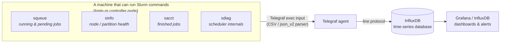

# telegraf-slurm-cfg

**Monitor a Slurm cluster without writing any scripts — just drop in these Telegraf config files.**

Every collector here is a single `.conf` file you copy into Telegraf's config
directory. No Python, no Bash wrappers, no cron jobs, nothing to maintain. The
Slurm commands already print machine-readable output; Telegraf's built-in
parsers turn that straight into metrics. That's the whole trick.

> **Just want to deploy?** Download the latest zip from the
> [**Releases**](https://github.com/mvalancy/telegraf-slurm-cfg/releases) page — a
> slim README + the `telegraf.d/` configs, nothing else. (Or build it yourself:
> `./build.sh`.) Everything below is the full reference: how it works, dashboards,
> and how it's tested.

---

## Wait — what are Slurm, Telegraf, and InfluxDB?

If you already know, skip to [Quick start](#quick-start). If not, here's the
30-second version:

- **Slurm** runs big shared computers ("clusters"). When many people want to run
  jobs on thousands of CPUs/GPUs, Slurm decides whose job runs where and when.
  You talk to it with commands like `squeue` (what's in the queue?) and `sinfo`
  (which machines are free?).
- **Telegraf** is a small agent that runs on a machine, collects numbers, and
  ships them somewhere. It has dozens of built-in *parsers* — it already knows
  how to read CSV and JSON, which is exactly what we exploit here.
- **InfluxDB** is a database built for time-stamped numbers ("time series").
  Telegraf writes the Slurm numbers into it every few seconds.
- **Grafana** (optional) reads InfluxDB and draws the dashboards.

Data flows: **Slurm command → Telegraf → InfluxDB → Grafana.**



---

## Why "no scripts"?

The usual way to feed Slurm into a database is to write a wrapper script that
runs `squeue`, reshapes the output, and prints something the database
understands. That script is one more thing to deploy, version, and break.

You don't need it. Slurm's own tools already print clean, delimited output, and
Telegraf already has parsers for it:

| Tool | How we get clean output | Telegraf parser |
|------|-------------------------|-----------------|
| `squeue` | `--format=%i\|%P\|...` → `\|`-delimited columns | `csv` |
| `sinfo`  | `--format=%R\|%T\|...` → `\|`-delimited columns | `csv` |
| `sacct`  | `--parsable2 --format=...` → `\|`-delimited columns | `csv` |
| `sdiag`  | `--json` → JSON object of scalar counters | `json_v2` |

Each collector is just an `[[inputs.exec]]` block that runs the command and
picks the parser. Everything lives in the `.conf`.

---

## Quick start

1. **Install Telegraf** on a machine that can run `squeue`/`sinfo`/etc.
   (usually a login or controller node).

2. **Tell Telegraf where to send data** — add an output once, in
   `/etc/telegraf/telegraf.conf` (InfluxDB 2.x / 3.x):

   ```toml
   [[outputs.influxdb_v2]]
     urls = ["http://YOUR_INFLUX_HOST:8086"]
     token = "YOUR_WRITE_TOKEN"
     organization = "YOUR_ORG"
     bucket = "slurm"
   ```

3. **Drop in the collectors you want:**

   ```bash
   sudo cp telegraf.d/slurm-squeue.conf /etc/telegraf/telegraf.d/
   sudo cp telegraf.d/slurm-sinfo.conf  /etc/telegraf/telegraf.d/
   sudo systemctl restart telegraf
   ```

4. **Using `slurm-sacct.conf`? Give the `telegraf` user accounting access.**
   Telegraf runs as the `telegraf` user, and `sacct --allusers` only returns
   *other* users' finished jobs if that user has Slurm **operator** privilege —
   otherwise the accounting collector silently sees just the `telegraf` user's
   own (empty) jobs. Grant it once, as a Slurm admin:

   ```bash
   sudo sacctmgr -i modify user telegraf set adminlevel=Operator
   # if the telegraf user isn't in the accounting DB yet, add it first:
   sudo sacctmgr -i add user telegraf account=root adminlevel=Operator
   ```

   (`squeue` / `sinfo` / `sdiag` need no special privilege — skip this if you're
   not collecting accounting.)

5. **Check one before deploying** (runs it once, prints what *would* be written,
   touches nothing):

   ```bash
   telegraf --test --config telegraf.d/slurm-squeue.conf
   # or the helper, which falls back to a bundled sample if you're off-cluster:
   ./test/debug.sh squeue
   ```

---

## What you get — measurement cheat sheet

| Command | Measurement | Tags | Numeric fields (plottable) | String fields (labels) |
|---------|-------------|------|----------------------------|------------------------|
| `squeue` | **`slurm_queue`** | job_id, partition, state, user, account, qos, reason | cpus, nodes, priority | time_limit, time_used, nodelist |
| `sinfo`  | **`slurm_nodes`** | partition, state | nodes | cpus_state, memory_mb |
| `sacct`  | **`slurm_accounting`** | job_id, partition, state, user, account, qos | cpus, nodes, elapsed_sec, cpu_sec | req_mem, start, submit, exit_code |
| `sdiag`  | **`slurm_scheduler`** | *(host only)* | ~40 scheduler/backfill counters | — |

`host` is added automatically by Telegraf. Uncomment `[inputs.exec.tags]` in any
file to add a static `cluster` tag.

---

## The collectors

### 1. `squeue` → `slurm_queue` (the queue)

One point per job currently running or waiting.
[`telegraf.d/slurm-squeue.conf`](telegraf.d/slurm-squeue.conf)

```
slurm_queue,host=login01,job_id=128411,partition=gpu,state=RUNNING,user=alice,account=physics,qos=normal,reason=None cpus=32i,nodes=1i,priority=4294901760i,time_limit="1-00:00:00",time_used="2:14:08",nodelist="gpu-node-007"
slurm_queue,host=login01,job_id=128412,partition=cpu,state=PENDING,user=bob,account=chem,qos=long,reason=Resources cpus=256i,nodes=8i,priority=100i,time_limit="UNLIMITED",time_used="0:00",nodelist=""
```

Great for: running vs pending per partition, who's using the most CPUs, and
*why* jobs are stuck (group by the `reason` tag).

### 2. `sinfo` → `slurm_nodes` (node health)

One point per partition + node-state (`sinfo` already aggregates the counts).
[`telegraf.d/slurm-sinfo.conf`](telegraf.d/slurm-sinfo.conf)

```
slurm_nodes,host=login01,partition=gpu,state=idle      nodes=4i,cpus_state="0/128/0/128",memory_mb="515000"
slurm_nodes,host=login01,partition=gpu,state=allocated nodes=8i,cpus_state="256/0/0/256",memory_mb="515000"
slurm_nodes,host=login01,partition=cpu,state=drain     nodes=1i,cpus_state="0/0/64/64",memory_mb="192000+"
```

Great for: how many nodes are down/draining, free vs busy capacity. The
**`nodes`** count is the plottable number. `cpus_state` is Slurm's
`allocated/idle/other/total` string, and `memory_mb` is a string too — when a
(partition,state) group spans nodes of differing memory, sinfo prints a
`+`-suffixed minimum like `192000+` (and `N/A` for unknown), so it's kept as a
string rather than risking a parse error that would drop the whole scrape.

### 3. `sacct` → `slurm_accounting` (finished jobs)

One point per *ended* job, **stamped at the job's end time**.
[`telegraf.d/slurm-sacct.conf`](telegraf.d/slurm-sacct.conf)

> Needs Slurm accounting (`slurmdbd`). If `sacct` says *"Slurm accounting storage
> is disabled"*, your cluster doesn't store this.

```
slurm_accounting,host=login01,job_id=128837,partition=gpu,state=COMPLETED,user=alice,account=physics,qos=normal cpus=32i,nodes=1i,elapsed_sec=3725i,cpu_sec=119200i,req_mem="64Gn",start="2026-06-15T10:00:00",submit="2026-06-15T09:59:50",exit_code="0:0" 1750000000000000000
```

Great for: throughput, failure rates, CPU-hours per account, turnaround time. It
queries a small rolling window each run so jobs aren't re-sent forever.

### 4. `sdiag` → `slurm_scheduler` (scheduler internals)

One point with ~40 fields about scheduler performance.
[`telegraf.d/slurm-sdiag.conf`](telegraf.d/slurm-sdiag.conf)

> Needs `sdiag --json` (Slurm **23.02+**). Older Slurm only prints plain text.

```
slurm_scheduler,host=login01 server_thread_count=3,jobs_pending=512,jobs_running=128,schedule_cycle_mean=1187,schedule_queue_length=480,bf_backfilled_jobs=890,bf_cycle_mean=312045,bf_queue_len=470,bf_depth_mean=51
```

Great for: spotting a struggling scheduler — long `schedule_cycle_mean`, growing
`schedule_queue_length`, or backfill falling behind. Cycle times are µs.

---

## Field data types (so everything plots)

A number stored as a string can't be graphed. These configs pin every numeric
column's type, so they land in InfluxDB correctly:

- **CSV collectors** (`slurm_queue`, `slurm_nodes`, `slurm_accounting`) set
  `csv_column_types`, so `cpus`, `nodes`, `priority`, `elapsed_sec`, `cpu_sec`
  are stored as **`long`** (integers).
- **`slurm_scheduler`** comes from JSON, so its counters are stored as
  **`double`** (with `bf_active` a boolean).
- Identifiers and human strings (`job_id`, `reason`, `time_limit`, `nodelist`,
  `cpus_state`, `memory_mb`, `req_mem`, `exit_code`, timestamps) are
  intentionally **strings / tags** — labels, not plot values. (`memory_mb` is a
  string because grouped `sinfo` can emit `192000+`/`N/A`; the plottable
  node-health number is the `nodes` count.)

`./test/run-tests.sh` round-trips through InfluxDB and **verifies** every numeric
field is `long`/`double` (see the report). Build graphs with the ready-made
queries in [`dashboards/`](dashboards/).

---

## Testing & debugging

```bash
./test/debug.sh squeue          # run ONE collector, print its line protocol
./test/debug.sh sdiag --fixture # force the bundled sample (no cluster needed)

./test/run-tests.sh             # test ALL collectors here -> report.html

./test/refresh-reports.sh       # rebuild EVERYTHING in test/reports/ in one go:
                                # the cross-OS matrix + index.html + the InfluxDB
                                # round-trip example (needs Docker + the influx CLI)
```

`run-tests.sh` checks every collector (against live Slurm when present, else the
bundled fixtures) and writes a clean **HTML report** capturing the git commit and
the OS / Telegraf / Slurm / InfluxDB versions — so it's easy to re-validate
against new versions with one command. If an `influx` CLI is configured it also
**round-trips the data through InfluxDB and queries the schema back**, rendering a
table of every measurement's tags and fields with their stored types — proving
each value lands queryable and plottable. See the committed example,
[`test/reports/influxdb-roundtrip-example.html`](test/reports/influxdb-roundtrip-example.html),
and the harness in [`test/`](test/).

### Tested against real Slurm (19.05 → 25.11)

These collectors are validated against a **real single-node Slurm cluster (with
`slurmdbd`)** spun up in Docker — one command per version:

```bash
./test/docker-test.sh ubuntu:24.04    # Slurm 23.11, full live run
./test/docker-matrix.sh               # all versions below
```

| Ubuntu | Slurm | squeue | sinfo | sacct | sdiag |
|--------|-------|:------:|:-----:|:-----:|:-----:|
| 20.04 | 19.05 | ✅ live | ✅ live | fixture¹ | fixture² |
| 22.04 | 21.08 | ✅ live | ✅ live | ✅ live | fixture² |
| 24.04 | 23.11 | ✅ live | ✅ live | ✅ live | ✅ live |
| 26.04 | 25.11 | ✅ live | ✅ live | ✅ live | ✅ live |

All four pass. `squeue`/`sinfo` run live on every version; `sacct` and `sdiag`
are validated live on every version that supports them. ¹ Slurm 19.05 can't
launch jobs on a cgroup-v2 host, so there's no finished-job data — `sacct` uses
the fixture there. ² `sdiag --json` doesn't exist before Slurm 23.02.

A consolidated cross-version summary is committed at
[`test/reports/index.html`](test/reports/index.html), with a detailed
per-version report (`report-ubuntu-<rel>-slurm-<ver>.html`) behind each row, plus
the InfluxDB round-trip example. The harness lives in
[`test/docker/`](test/docker/).

---

## Dashboards

[`dashboards/`](dashboards/) is a copy-paste Flux cookbook — queue, nodes,
scheduler, and accounting panels for InfluxDB Data Explorer or Grafana. Start
there; each `// ── Panel: …` block is one graph.

---

## Hardening, compatibility & gotchas

**`job_id` is a tag on purpose.** Two jobs that share partition/state/user/
account/qos would otherwise collide (same series + timestamp) and one would be
lost. Making `job_id` a tag keeps every job distinct — at the cost of series
cardinality, so **send `slurm_queue` / `slurm_accounting` to a bucket with short
retention** (e.g. 7–30 days) to keep the series count bounded. `slurm_nodes` and
`slurm_scheduler` are low-cardinality.

**Telegraf must find the Slurm binaries.** They often live in `/opt/slurm/bin`
while Telegraf's systemd unit has a minimal `PATH` — the #1 cause of an empty
collector. Use an absolute path in `commands`, or uncomment the
`environment = ["PATH=…"]` line in each `.conf`.

**`sacct --allusers` needs privilege.** The telegraf user must be allowed to read
*other* users' accounting (operator/admin), or it sees only its own (empty) jobs.

**Version requirements.** `squeue`/`sinfo` `--format` and `sacct --parsable2`
work on essentially any modern Slurm. `sdiag --json` needs Slurm **23.02+**. The
`csv` parser is ancient in Telegraf; `json_v2` (for `sdiag`) needs Telegraf
**1.19+**. Ubuntu version itself is irrelevant — the configs are plain TOML with
no shell/Python dependency; what matters is the Slurm and Telegraf versions.

**Delimiter safety.** The CSV trick uses `|`. Slurm fields like partition/state/
user/numbers never contain `|`, but job *names* can — so job name is deliberately
left out. `csv_trim_space = true` guards against any column padding.

**It fails loudly, by design.** If `slurmctld` is down the command errors and you
get a gap in the data (the gap is the signal) — the configs don't hide that.

---

## Releases & packaging

Tagged releases ship a ready-to-copy zip — a slim deploy README + `LICENSE` +
the `telegraf.d/` folder, nothing else. To cut one:

```bash
git tag v1.0.0
git push origin v1.0.0
```

The [release workflow](.github/workflows/release.yml) runs
[`build.sh`](build.sh) and attaches `telegraf-slurm-cfg-v1.0.0.zip` to the GitHub
Release. You can build the same package locally any time with `./build.sh`
(output lands in `dist/`).

---

## License

[MIT](LICENSE)
