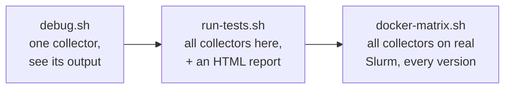
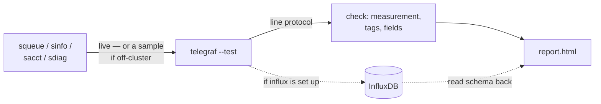
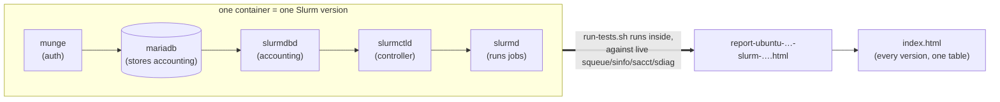

# Tests

Everything here answers one question: **do the collectors actually produce
correct, plottable metrics?** You can check at three levels — each one more
thorough (and slower) than the last.



## What's in here

| File / folder | What it's for |
|---------------|---------------|
| `debug.sh <plugin>` | Run **one** collector (`squeue` / `sinfo` / `sacct` / `sdiag`) and print exactly what it would send to InfluxDB. The fastest way to eyeball a change. |
| `run-tests.sh` | Run **all** collectors on this machine and write `report.html` (pass/fail + versions). If the `influx` CLI is set up, it also writes the data into InfluxDB and reads the schema back. |
| `docker-test.sh <image>` | Spin up a **real** single-node Slurm cluster in Docker and run the tests against it. |
| `docker-matrix.sh` | Do that for several Slurm versions at once and build a summary. |
| `refresh-reports.sh` | One command to rebuild everything under `reports/`. |
| `preview-dashboards.py` | Render the sample dashboard images: simulate a cluster, write it to InfluxDB, run the real `dashboards/*.flux` queries, save one PNG per dashboard. |
| `lib.sh` | Shared helpers — you don't run this directly. |
| `docker/` | The Dockerfile + start-up script for the throwaway Slurm cluster. |
| `reports/` | The committed HTML results (start at `reports/index.html`). |
| `dashboard/` | The committed dashboard preview PNGs (the quad grid in the top-level README). |

## Check one collector

```bash
./test/debug.sh squeue            # uses real Slurm if it's installed, else a bundled sample
./test/debug.sh sdiag --fixture   # force the sample (no cluster needed)
```

## Check everything on this machine

```bash
./test/run-tests.sh               # writes report.html
```

Each collector's command runs (or a bundled sample stands in if the command
isn't there), Telegraf parses the output, and we check that the expected
measurement, tags, and fields all show up. If the `influx` CLI is configured it
goes one step further: it writes the data into InfluxDB and reads the tags and
fields back out, so you can see the real stored types.



## Check against real Slurm (Docker)

Samples are fine for a quick check, but to prove the collectors against the real
thing — including `sacct` (needs the accounting database) and `sdiag --json` —
the Docker harness builds a complete single-node Slurm cluster in a container:

```bash
./test/docker-test.sh ubuntu:24.04   # one version  (Ubuntu 24.04 ships Slurm 23.11)
./test/docker-matrix.sh              # the whole matrix (20.04 / 22.04 / 24.04 / 26.04)
```

Inside each container the pieces start in order, then the test suite runs
against the live cluster:



A different Ubuntu base image gives a different Slurm version, which is how one
command covers Slurm 19.05 → 25.11.

## The reports

- **`reports/index.html`** — start here. One table, a row per OS / Slurm
  version, showing whether each collector ran **live** or fell back to a sample.
- **`reports/report-ubuntu-<rel>-slurm-<ver>.html`** — the detail behind each row.
- **`reports/influxdb-roundtrip-example.html`** — every measurement's tags and
  fields, queried back out of InfluxDB.

Rebuild them all in one go:

```bash
./test/refresh-reports.sh         # needs Docker + the influx CLI
```

## The dashboard previews

The PNGs under `dashboard/` (and the quad grid in the top-level README) are
generated, not hand-made. `preview-dashboards.py` simulates ~3 hours of a small
cluster, writes that history to a throwaway `slurm_demo` bucket, runs the **same
queries** shipped in `dashboards/*.flux`, and draws one image per dashboard — so
the screenshots can't drift far from the real queries.

```bash
python3 test/preview-dashboards.py            # writes test/dashboard/*.png
python3 test/preview-dashboards.py --out /tmp  # render somewhere else
```

Needs `matplotlib` and the `influx` CLI (the same one the round-trip check uses).
It's a developer tool for refreshing the screenshots — you never need it to
deploy or use the collectors.
